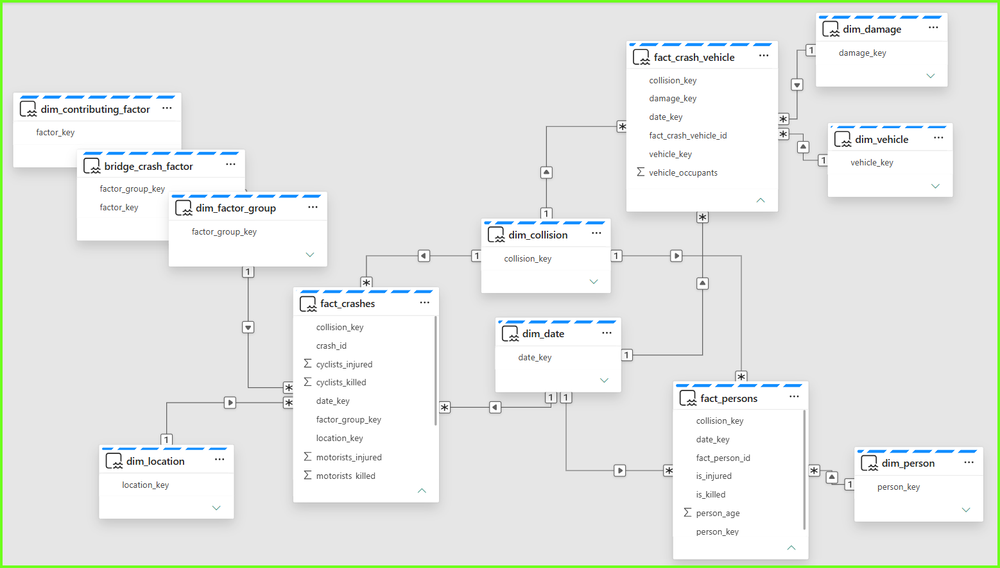

# Semantic Model — NYC_VehicleCrashes_Semantic

## Overview

Fabric semantic model `NYC_VehicleCrashes_Semantic`, in **Direct Lake** storage mode over
Fabric Warehouse `NYC_VehicleCrashes_Warehouse` (read through OneLake). It exposes the NYC
Motor Vehicle Collisions data as a Kimball star schema: three fact tables sharing conformed
dimensions, plus one bridge table for the many-to-many contributing-factor relationship.

The `definition/` TMDL under repo folder
`4_Model/NYC_VehicleCrashes_Semantic.SemanticModel/` is the authoritative source — the model is
authored locally and pushed to ADO, then pulled into the workspace via Fabric Source Control.

## Tables

| Table | Role | Grain | Notes |
|---|---|---|---|
| `fact_crashes` | Fact | One crash event | Additive casualty columns (persons / pedestrians / cyclists / motorists, injured & killed) |
| `fact_crash_vehicle` | Fact | One vehicle involved in a crash | `vehicle_occupants` is BLANK when unreported, not 0 |
| `fact_persons` | Fact | One person involved in a crash | `is_injured` / `is_killed` flags, `person_age` |
| `bridge_crash_factor` | Bridge | One factor-group ↔ factor pair | Resolves the many-to-many between a crash and its contributing factors |
| `dim_date` | Dimension | One calendar day | Marked date table on `full_date`; year / quarter / month / day / day_name / is_weekend |
| `dim_collision` | Dimension | One collision ID | Conformed key shared by all three facts |
| `dim_location` | Dimension | One location | borough, zip_code, latitude, longitude |
| `dim_vehicle` | Dimension | One vehicle profile | type, make, model, year, registration, driver license status/jurisdiction, driver sex |
| `dim_damage` | Dimension | One damage profile | pre_crash, point_of_impact, vehicle_damage |
| `dim_person` | Dimension | One person profile | person_type, sex, ejection, bodily injury, safety equipment, pedestrian location/action/role |
| `dim_contributing_factor` | Dimension | One contributing factor | `factor_desc` |
| `dim_factor_group` | Dimension | One distinct set of factors per collision | Joins `fact_crashes` to the bridge |

## Relationships

Thirteen single-column relationships, one-to-many from dimension to fact, single-direction
filtering — with one deliberate exception:

- `bridge_crash_factor[factor_group_key] → dim_factor_group[factor_group_key]` is
  **bothDirections**. Without it, filtering by contributing factor silently returns the full
  crash count instead of the filtered subset.
- All three facts join `dim_date` on `date_key` and `dim_collision` on `collision_key`, giving
  conformed date and collision context across crash-, vehicle-, and person-grain analysis.
- `fact_crash_vehicle` additionally joins `dim_vehicle` and `dim_damage`; `fact_persons` joins
  `dim_person`; `fact_crashes` joins `dim_location` and `dim_factor_group`.

## Measures

| Home table | Measures |
|---|---|
| `fact_crashes` | Total Crashes; Persons / Pedestrians / Cyclists / Motorists Injured and Killed; Crashes with Injury; Crashes with Fatality; Injury Rate; Fatality Rate; Injuries per Crash; Crashes PY; Crashes YoY %; Crashes PM; Crashes MoM % |
| `fact_crash_vehicle` | Total Vehicles Involved; Total Occupants; Vehicles with Occupant Data; Average Occupants per Vehicle; Vehicles per Crash; Occupant Data Coverage % |
| `fact_persons` | Total Persons Involved; Injured Persons; Killed Persons; Person Injury Rate; Average Person Age |

Time intelligence (`Crashes PY` / `Crashes PM`) resolves against `dim_date[full_date]`.

Occupancy measures are gated on `Occupant Data Coverage %`: roughly 40% of source vehicle rows
report no occupant count at all, and blankness — not a `> 0` test — is what separates missing
from a genuine zero.

## Conventions

- **SummarizeBy:** all `_key` and `_id` columns → `None`; numeric dimension attributes
  (year, quarter, month, day, day_of_week, vehicle_year) → `None`; `person_age` → `Average`;
  `vehicle_occupants` → `Sum`. A schema refresh resets these to `Sum` — re-apply after any refresh.
- **Authoring path:** local TMDL edits → commit/push to ADO → Fabric Source Control → Update All.
  Do not author this model through XMLA/MCP; those writes hit workspace state and bypass Git.
- `dbo.etl_watermark` is excluded from the model (ETL control table, not analytic content).
