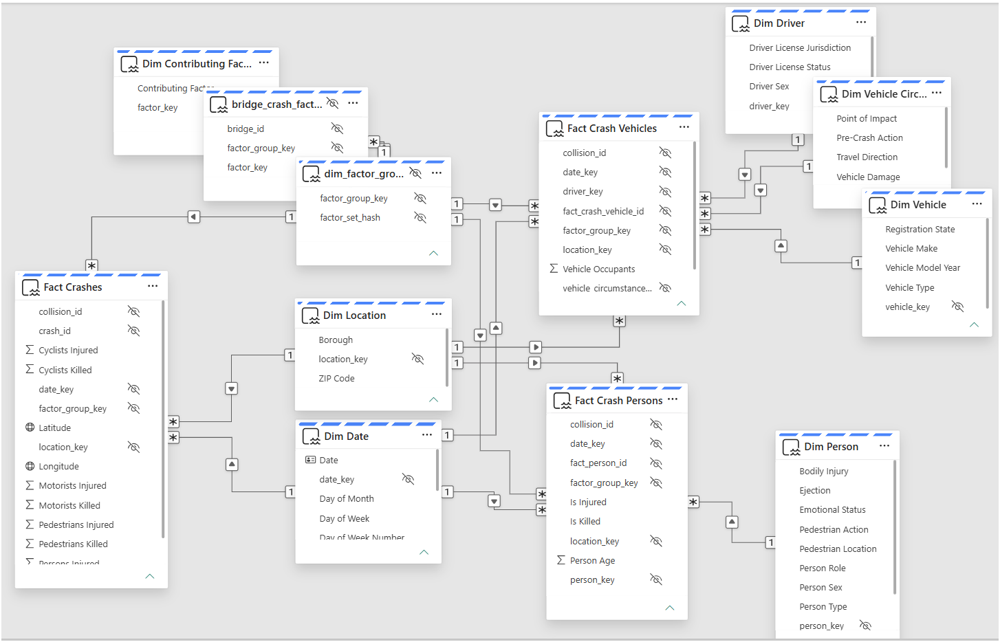

# Semantic Model — NYC_VehicleCrashes_Semantic

## Overview

This semantic model is the project's **deliverable**: a governed, documented model for
self-service report authors. Reports are its consumers and sit outside the scope of this build.

Fabric semantic model `NYC_VehicleCrashes_Semantic`, in **Direct Lake on SQL** storage mode over
Fabric Warehouse `NYC_VehicleCrashes_Warehouse`. It exposes the NYC Motor Vehicle Collisions data
as a Kimball header/line star schema: one header fact at crash grain and two line facts, with every
header key copied onto the lines. One bridge table resolves the many-to-many contributing-factor
relationship. Design decisions: [ADR-0005](../../docs/adr/0005-header-line-fact-design.md) (header/line
design) and [ADR-0004](../../docs/adr/0004-direct-lake-on-sql-with-per-stage-rules.md) (Direct Lake on
SQL, rebound per stage by a deployment rule). The model is identical in Dev, Test and Prod.

The `definition/` TMDL under
[`NYC_VehicleCrashes_Semantic.SemanticModel/`](NYC_VehicleCrashes_Semantic.SemanticModel/) is the
authoritative source. The model is authored locally, pushed to ADO, then pulled into the workspace
via Fabric Source Control.

## Tables

Visible tables and columns carry business names; the Warehouse name is in brackets. The full
mapping is in [`CONTEXT.md`](../../CONTEXT.md). Every `_key` and `_id` column is hidden.

| Table | Role | Grain | Visible columns and notes |
|---|---|---|---|
| **Fact Crashes** (`fact_crashes`) | Header fact | One crash | Persons / Pedestrians / Cyclists / Motorists × Injured / Killed (additive casualty counts); Latitude, Longitude. `collision_id` is a hidden degenerate dimension |
| **Fact Crash Vehicles** (`fact_crash_vehicle`) | Line fact | One vehicle in a crash | Vehicle Occupants: BLANK when unreported, not 0. Header keys `date_key`, `location_key`, `factor_group_key` and `collision_id` are copied from its crash |
| **Fact Crash Persons** (`fact_persons`) | Line fact | One person in a crash | Person Age, Is Injured, Is Killed. Person Age: BLANK when unknown — the ETL loads ages below 0 or above 110 as NULL, and 0 as NULL unless Person Role is Passenger or Pedestrian (real infants). Header keys copied from its crash, as above |
| `bridge_crash_factor` | Bridge | One factor group × factor pair | All columns hidden. Resolves the many-to-many between a crash's factor set and its contributing factors |
| `dim_factor_group` | Dimension | One distinct set of contributing factors | All columns hidden; `factor_set_hash` identifies the set. One empty-set group, with no bridge rows, covers crashes with no specified factor |
| **Dim Date** (`dim_date`) | Dimension | One calendar day | Marked date table on Date, formatted `yyyy-mm-dd`. Year, Quarter, Month Number, Month (sorts by Month Number), Day of Month, Day of Week Number, Day of Week (sorts by Day of Week Number), Is Weekend |
| **Dim Location** (`dim_location`) | Dimension | One borough / ZIP code | Borough, ZIP Code. One **Unknown** member (both `UNKNOWN`) covers crashes with no location |
| **Dim Contributing Factor** (`dim_contributing_factor`) | Dimension | One contributing factor | Contributing Factor |
| **Dim Vehicle** (`dim_vehicle`) | Dimension | One vehicle profile | Vehicle Type, Vehicle Make, Vehicle Model Year, Registration State |
| **Dim Vehicle Circumstance** (`dim_vehicle_circumstance`) | Dimension | One vehicle-in-crash profile | Pre-Crash Action, Travel Direction, Point of Impact, Vehicle Damage |
| **Dim Driver** (`dim_driver`) | Dimension | One driver profile | Driver Sex, Driver License Status, Driver License Jurisdiction |
| **Dim Person** (`dim_person`) | Dimension | One person profile | Person Type, Person Sex, Ejection, Emotional Status, Bodily Injury, Position in Vehicle, Safety Equipment, Pedestrian Location, Pedestrian Action, Person Role |

There is no collision dimension: `collision_id` sits on all three facts as a degenerate dimension.
`dbo.etl_watermark` is excluded, because it's an ETL control table, not analytic content.

## Relationships

Fifteen single-column relationships, one-to-many from dimension to fact (or bridge). All filter in a
single direction except for one deliberate exception:

- The relationship from `bridge_crash_factor` to `dim_factor_group` (on `factor_group_key`) is
  **bothDirections**. Without it, filtering by contributing factor silently returns the full crash
  count instead of the filtered subset.
- **Header dimensions reach every fact.** Dim Date, Dim Location and `dim_factor_group` each join
  all three facts, so a date, borough or contributing factor filters crash-, vehicle- and
  person-grain rows alike. Dim Contributing Factor reaches the facts through the bridge and
  `dim_factor_group`.
- **Line dimensions reach only their own fact.** Fact Crash Vehicles also joins Dim Vehicle,
  Dim Vehicle Circumstance and Dim Driver. Fact Crash Persons also joins Dim Person.
- **Lines don't filter the header:** a vehicle or person attribute doesn't filter Fact Crashes.
  That needs business definitions first and is deferred
  ([`line-to-header-filtering`](../../.scratch/_Backlog/line-to-header-filtering/)).
- **Every relationship assumes referential integrity** (`relyOnReferentialIntegrity`, all 15,
  bridge included). Without it, Direct Lake adds a blank member to every dimension as a safeguard
  (per community reports, not Microsoft documentation), so every slicer offers "(Blank)" even
  with zero orphaned keys. With it, no slicer offers the safeguard "(Blank)".
  - *Accepted risk:* if a fact or bridge row ever carries a NULL or orphaned key, it drops out of
    dimension-filtered totals instead of showing as "(Blank)", and grand totals then no longer
    equal the sum across a dimension's members.
  - *Standing guard:* `/dax-smoke-test` check 3 (orphans) after every stage load proves the ETL
    guarantee of zero NULL or orphaned keys; check 6 asserts the flag is still set.

| Dimension | Fact Crashes | Fact Crash Vehicles | Fact Crash Persons | `bridge_crash_factor` |
|---|---|---|---|---|
| Dim Date | ✓ | ✓ | ✓ | |
| Dim Location | ✓ | ✓ | ✓ | |
| `dim_factor_group` | ✓ | ✓ | ✓ | ✓ (bothDirections) |
| Dim Contributing Factor | | | | ✓ |
| Dim Vehicle | | ✓ | | |
| Dim Vehicle Circumstance | | ✓ | | |
| Dim Driver | | ✓ | | |
| Dim Person | | | ✓ | |

## Measures

**None yet.** All measures were removed on 2026-09-27 in the header/line remodel. A measure layer
will be generated from this model in a separate spec. Until then, the model is validated with
`COUNTROWS` and key-level DAX queries rather than measures.

There are no security roles either. `Borough_Reader` was deleted because its filter leaked into
the line facts; security roles are deferred.

## Conventions

- **SummarizeBy:** every `_key` and `_id` column (including `collision_id`) → `None`. Numeric
  dimension attributes (Year, Quarter, Month Number, Day of Month, Day of Week Number, Vehicle
  Model Year) → `None`. Latitude / Longitude → `None`, with `dataCategory` Latitude / Longitude.
  Person Age → `Average`. Vehicle Occupants and the casualty counts → `Sum`. A schema refresh
  resets SummarizeBy to `Sum`, so re-apply these after any refresh.
- **Authoring path:** local TMDL edits → commit/push to ADO → Fabric Source Control → Update All.
  Don't author this model through XMLA/MCP; those writes hit workspace state and bypass Git.
