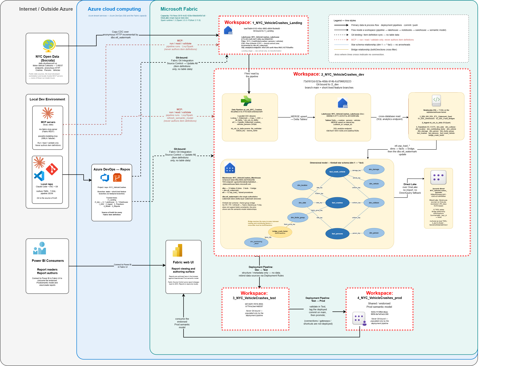

# NYC Motor Vehicle Collisions — Microsoft Fabric

An end-to-end analytics build on Microsoft Fabric using the NYC Open Data motor vehicle collision
datasets. A watermark-driven CDC pipeline lands source data in a Lakehouse. Stored procedures load
it into a Kimball star schema in a Fabric Warehouse. A Direct Lake semantic model, authored as
TMDL in git, serves Power BI. The build is promoted Dev → Test → Prod through Fabric deployment
pipelines. Every Fabric item is under source control, and design decisions are recorded as ADRs.

## What this demonstrates

- **Fabric end to end:** Lakehouse, Warehouse, notebooks, Data Pipelines, Variable Library,
  Direct Lake semantic model, across a landing workspace and Dev, Test and Prod.
- **Dimensional modeling:** a Kimball star schema with conformed dimensions, a header fact
  (`fact_crashes`) and two line facts, and a factor-group bridge for the many-to-many between
  crashes and contributing factors ([ADR-0005](docs/adr/0005-header-line-fact-design.md)).
- **Incremental loading:** CDC ingestion from the Socrata API, filtered by a single
  authoritative watermark, feeding idempotent `etl.usp_load_*` stored procedures.
- **Semantic modeling as code:** the model is authored in TMDL in git, never edited in the
  service. It runs Direct Lake on SQL and is rebound per stage by a deployment rule ([ADR-0004](docs/adr/0004-direct-lake-on-sql-with-per-stage-rules.md)).
- **Release management:** Fabric Git Integration for Dev, deployment pipelines for Test and Prod,
  and per-stage configuration in a Variable Library ([ADR-0003](docs/adr/0003-variable-library-for-stage-config.md)).
- **Engineering discipline:** Architecture Decision Records, a domain glossary, specs broken into
  tickets, and post-load validation of row counts and key integrity.
- **Governed AI-assisted development:** Claude Code works under documented project rules and
  enforced permission settings ([`CLAUDE.md`](CLAUDE.md), [`.claude/`](.claude/)). Git is the source of truth; Fabric MCP
  tools are limited to running, reading and validating.

## Nature of this repo

This is a personal demonstration project. It runs on Microsoft Fabric **trial capacity** using
**public** NYC Open Data, and the repo holds **no credentials**. Fabric workspace and item IDs,
the tenant ID, working notes, runbooks and the backlog are published **unredacted on purpose**.
None of them grant access to anything, and together they show how the work was actually done.
One historical NYC Open Data app token appears in early commits; it was rotated and is dead
([ADR-0001](docs/adr/0001-rotate-nyc-open-data-app-token.md)).

The primary repo lives in **Azure DevOps**, where Fabric Git Integration is bound. The GitHub
copy is a **read-only mirror**, updated automatically from Azure DevOps, so issues and pull
requests here aren't monitored.

## Architecture

| Layer | Implementation |
|---|---|
| Ingestion | CDC pipeline (`pl_cdc_NYC_Crashes_Landing`, landing workspace) loads Socrata endpoints into `Files/raw/`, watermark-filtered. The watermark is Delta table `etl_watermark` in the landing lakehouse, written only by notebook `nb_etl_watermark`. The Dev-workspace predecessor pipeline `pl_cdc_NYC_Crashes` was retired 2026-09-10 |
| Staging | Notebook `nb_cdc_to_delta` (Dev) merges the staged CSVs, read through a OneLake shortcut to the landing lakehouse, into Delta tables |
| Warehouse | Kimball star schema — conformed dimensions, three facts, and a factor-group bridge — loaded by `etl.usp_load_*` stored procedures |
| Semantic model | Direct Lake on SQL, Warehouse-sourced; rebound per stage by a deployment data source rule ([ADR-0004](docs/adr/0004-direct-lake-on-sql-with-per-stage-rules.md)); authored as TMDL in this repo |
| Orchestration | Pipeline `pl_stage_load_NYC_Crashes` runs ingest, the full transform graph and the model refresh for a stage |
| Reports | Authored in the Fabric web UI only, synced back through Git integration. None are published at present: the earlier reports were retired 2026-09-25 |

## Repo layout

| Path | Contents |
|---|---|
| [`1_Landing/`](1_Landing/) | Landing-zone workspace, bound separately — landing lakehouse, CDC pipeline, watermark notebook. Owned upstream of Dev/Test/Prod |
| [`2_dev/`](2_dev/) | Dev workspace, Git-bound. All Dev Fabric items live here |
| [`2_dev/0_Storage/`](2_dev/0_Storage/) | Lakehouse and Warehouse item definitions. The Warehouse item holds the deployed copy of every stored procedure |
| [`2_dev/1_DDL/`](2_dev/1_DDL/) · [`3_Transform/`](2_dev/3_Transform/) | DDL and ETL notebooks. `3_Transform/` is the source of truth for stored procedures — change it and the Warehouse item together |
| [`2_dev/2_Ingest/`](2_dev/2_Ingest/) | Notebook `nb_cdc_to_delta`, restored 2026-09-11 after the pipeline retirement |
| [`2_dev/4_Model/`](2_dev/4_Model/) | Semantic model TMDL — the authoritative source for model changes — plus notebook `RefreshSemanticModel` |
| [`2_dev/6_Orchestration/`](2_dev/6_Orchestration/) | Stage-load Data Pipeline `pl_stage_load_NYC_Crashes` |
| [`2_dev/99_Config/`](2_dev/99_Config/) | Variable Library `vl_NYC_Crashes` — per-stage configuration values ([ADR-0003](docs/adr/0003-variable-library-for-stage-config.md)) |
| [`Context/`](Context/) | Environment reference — live physical Fabric IDs — and operational runbooks |
| [`docs/adr/`](docs/adr/) | Architecture Decision Records |
| [`docs/agents/`](docs/agents/) | Agent conventions — issue tracker, triage labels, domain docs |
| [`CONTEXT.md`](CONTEXT.md) | Domain glossary |
| [`Diagrams/`](Diagrams/) | As-built architecture diagrams — documentation, not spec |
| [`.scratch/`](.scratch/) | Backlog — specs and issues as local Markdown files |
| [`Other/`](Other/) | Ad-hoc SQL scratch |

## Working conventions

Git is the source of truth. Semantic model and warehouse changes are authored locally,
pushed to Azure DevOps, then pulled into the workspace via Fabric Source Control →
Update All. Test and Prod receive content through deployment pipelines, not Git.

Full conventions and constraints: [`CLAUDE.md`](CLAUDE.md).
Current work: issues under [`.scratch/`](.scratch/) (see [`docs/agents/issue-tracker.md`](docs/agents/issue-tracker.md)).

## License

[MIT](LICENSE)
